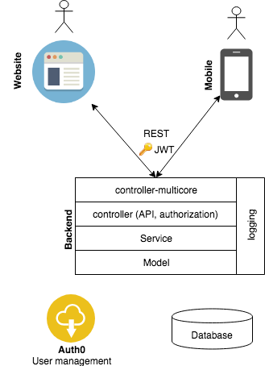

# One-Lang Todo Application

Unopionated boilerplate code to create Backend + Web + Mobile applications entirely on JavaScript. Quick to setup and deploy. Ready to be used in hackatons, proof of concepts or early startups. 

It covers:

* Backend - Postgresql, Authentication through Auth0, logging, ready to be deployed on Heroku
* Web - React, Bootstrap 3, SCSS, Redux, Authentication, ESLint
* Mobile - React-Native, Expo, Native-Base, React-Navigation, Redux, Authentication, ESLint

This is a spin-off from a private project. 

## Philosophy

The project aims to shorten the idea-to-market time. It should not take more than one hour to have a todo application running locally (backend + web in chrome + mobile in simulator). And at most one more hour to have the backend + web deployed on Heroku and mobile published to Expo. That's all. In a blink of an eye you are ready to send links to a web page and mobile apps to your friends or potential customers. 

The code is highly customizable and simple. The project is implemented using the popular layer architecture: each layer can be easily replaced without affecting much the other layers. For example, backend can be replaced with Spring Boot or with Firebase without affecting web and mobile. Mobile can be replaced with Swift and Kotlin without affecting backend and web. 

## Architecture

Backend provides same API for both web and mobile. The authentication is done using [JSON Web Tokens](https://en.wikipedia.org/wiki/JSON_Web_Token).

## Local setup

Each project explains the setup of local environment. Do it in the following order:

1. [backend](backend) - make sure that it starts without any errors.
2. [front-web](front-web) - make sure that the website loads and that it connects to the locally running backend.
3. [front-mobile](front-mobile) - make sure that it runs in the simulator and connects to the locallly running backend.

## Deployment

## License

The MIT License

Copyright (c) 2017 - 2018 Eugen Sorbalo

Permission is hereby granted, free of charge, to any person obtaining a copy
of this software and associated documentation files (the "Software"), to deal
in the Software without restriction, including without limitation the rights
to use, copy, modify, merge, publish, distribute, sublicense, and/or sell
copies of the Software, and to permit persons to whom the Software is
furnished to do so, subject to the following conditions:

The above copyright notice and this permission notice shall be included in
all copies or substantial portions of the Software.

THE SOFTWARE IS PROVIDED "AS IS", WITHOUT WARRANTY OF ANY KIND, EXPRESS OR
IMPLIED, INCLUDING BUT NOT LIMITED TO THE WARRANTIES OF MERCHANTABILITY,
FITNESS FOR A PARTICULAR PURPOSE AND NONINFRINGEMENT. IN NO EVENT SHALL THE
AUTHORS OR COPYRIGHT HOLDERS BE LIABLE FOR ANY CLAIM, DAMAGES OR OTHER
LIABILITY, WHETHER IN AN ACTION OF CONTRACT, TORT OR OTHERWISE, ARISING FROM,
OUT OF OR IN CONNECTION WITH THE SOFTWARE OR THE USE OR OTHER DEALINGS IN
THE SOFTWARE.
